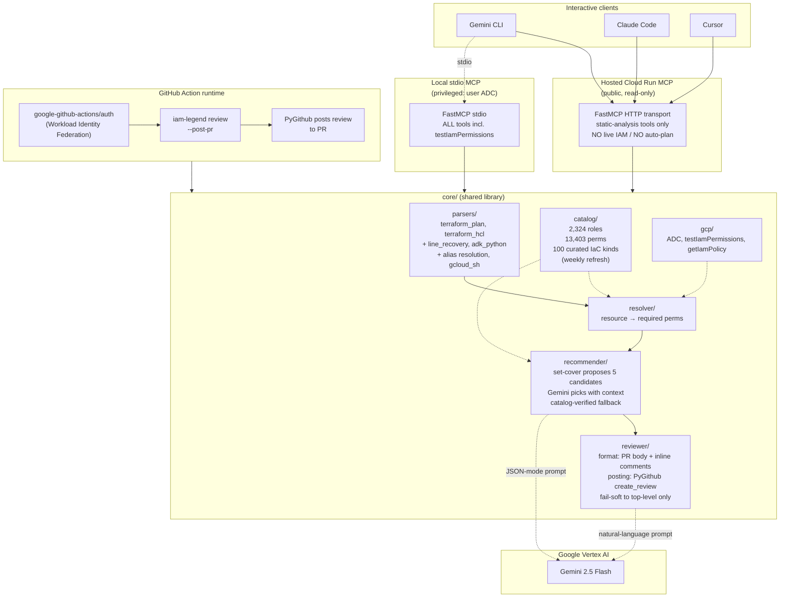

# iam-legend — Architecture

## Three surfaces, one core

iam-legend ships as **one shared Python library** consumed by three independent surfaces:

1. **MCP server (stdio + Cloud Run HTTP).** The interactive surface for AI agents. Stdio mode runs as the user with full ADC and all tools; HTTP mode is hosted on Cloud Run as a public read-only instance with privileged tools (live IAM diff, auto-plan) deliberately ungated.

2. **GitHub Action.** Posts AI code reviews on PRs after `terraform plan` (or in static `--repo` mode). Authenticates as the deployer SA via Workload Identity Federation, so `testIamPermissions` answers for the *actual* principal the apply will run as.

3. **CLI.** `iam-legend review --plan plan.json` for ad-hoc local checks; `iam-legend lookup roles/storage.admin` for catalog browsing.

## Where Gemini fires

Two narrow LLM call sites, both inside `core/`:

- **`recommender/recommend.py::_call_gemini`** — set-cover proposes 5 candidate role bundles with metadata (covered perms, extra-perms count, per-service breakdown). Gemini picks one by index with full context. Catalog-verified before being returned; falls back to deterministic candidate[0] if Gemini hallucinates an index or fails entirely.

- **`reviewer/format.py::_call_gemini`** — formats the top-level PR review body. Falls back to templated prose if Vertex is unreachable.

Gemini is **off the critical path of correctness**. The math (set-cover) is deterministic; the LLM provides judgment + prose only.

## Auth model

- **Local stdio MCP:** runs as you. Privileged tools available. ADC via `gcloud auth application-default login`.
- **Hosted Cloud Run MCP:** runs as `iam-legend-runtime` SA. Has `roles/aiplatform.user` for the Gemini calls only. NO read access to user projects. Read-only tools only.
- **GitHub Action:** runs after `google-github-actions/auth` (Workload Identity Federation + OIDC). ADC = the deployer SA. `testIamPermissions` answers for the same principal that will run `terraform apply`.

Never passes user GCP credentials via tool arguments. Never holds long-lived service account keys.
